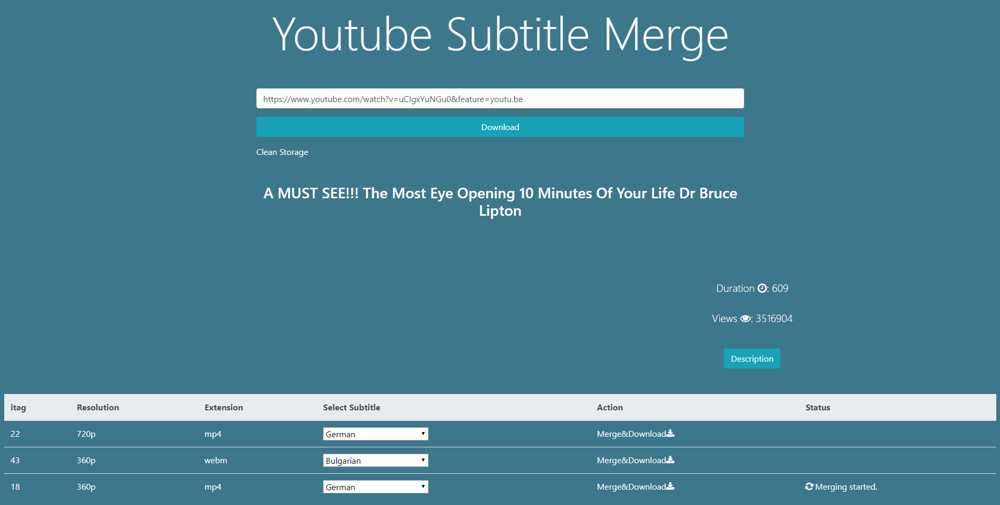
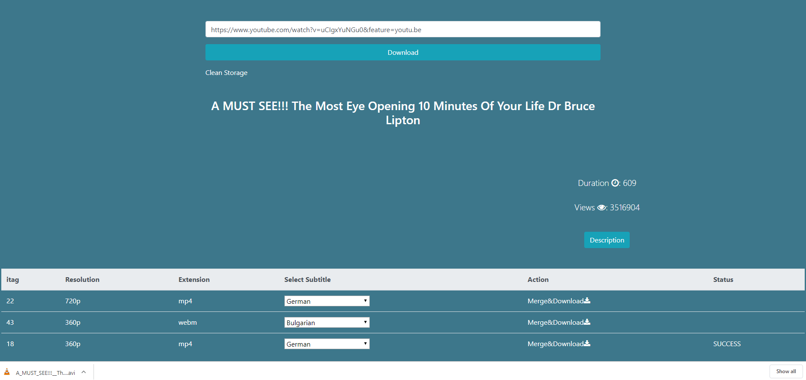

# Youtube Downloader

Youtube Downloader is a Python Web application built with Django.






# FEATURES!

  - Download Youtube videos in every format with video and audio channels.
  - Merge Youtube's Video and Subtitle.


# REQUIREMENTS
  - This App Uses Python 3.7, Pytube, Django 2.1, FFMPEG.

# INSTALLATION

Install the dependencies and devDependencies and start the server.

```sh
$ git clone https://github.com/devstar2001/download_merge_subtitle.git
$ cd Youtube-Downloader
$ pip install -r requirements.txt
$ python manage.py runsever
```

# LICENSE
MIT License